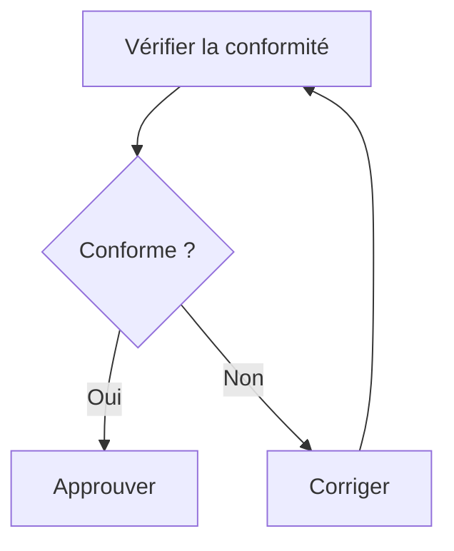

# 🚀 Guide d'Intégration - Task Automation & Formation V2

## 📋 Table des matières
1. [Task Automation](#task-automation)
2. [Formation V2](#formation-v2)
3. [Intégration Firestore](#intégration-firestore)

---

## 🔄 Task Automation

### Qu'est-ce que c'est ?
Convertir automatiquement les nœuds d'un diagramme Mermaid en tâches du plan de conformité.

**Fichiers créés :**
- `/src/lib/mermaidParser.ts` - Parser Mermaid
- `/src/components/plan/WorkflowAutomationDialog.tsx` - UI Automatisation

### Comment l'intégrer ?

#### Étape 1 : Ajouter le bouton dans la page Plan

Dans [src/app/(app)/plan/page.tsx](src/app/(app)/plan/page.tsx), ajouter l'import et le bouton :

```tsx
import { WorkflowAutomationDialog } from '@/components/plan/WorkflowAutomationDialog';

// Dans le composant PlanPage, ajouter l'état :
const [automationDialog, setAutomationDialog] = React.useState<{
  open: boolean;
  workflowCode?: string;
  workflowName?: string;
  workflowId?: string;
}>({ open: false });

// Dans le rendu des workflows, ajouter le bouton :
<Button 
  onClick={() => setAutomationDialog({
    open: true,
    workflowCode: activeWorkflow.code,
    workflowName: subCategory.name,
    workflowId: subCategory.id
  })}
  className="gap-2"
>
  <Zap className="h-4 w-4" /> Générer les tâches
</Button>

// Ajouter le composant Dialog :
<WorkflowAutomationDialog
  open={automationDialog.open}
  onOpenChange={(open) => setAutomationDialog({ ...automationDialog, open })}
  mermaidCode={automationDialog.workflowCode || ''}
  workflowName={automationDialog.workflowName || ''}
  workflowId={automationDialog.workflowId || ''}
  onTasksGenerated={async (tasks) => {
    // Ajouter chaque tâche à la sous-catégorie
    for (const task of tasks) {
      await addTask(
        currentCategoryId,
        automationDialog.workflowId!,
        task
      );
    }
  }}
/>
```

#### Étape 2 : Parser des nœuds Mermaid

La fonction `parseMermaidNodes()` supports :
- Rectangles : `A["Texte"]`
- Arrondis : `A(["Texte"])`
- Diamants : `A{"Texte"}`
- Cercles : `A(("Texte"))`
- Parallélogrammes : `A[/"Texte"/]`

Exemples Mermaid :


Résultat :
```
✅ 4 tâches détectées :
  - Vérifier la conformité
  - Conforme ?
  - Approuver
  - Corriger
```

---

## 📚 Formation V2

### Qu'est-ce que c'est ?
Interface de gestion des formations **simplifiée et collaborative**, remplaçant l'onglet de formation classique.

**Fichier créé :**
- `/src/app/(app)/training-v2/page.tsx` - Nouvelle page Formation

### Caractéristiques

#### 1. **Calendrier des Formations**
- Vue claire des formations planifiées, en cours, et complétées
- Affiche formateur, durée, participants, taux de complétion
- Édition et suppression rapide

#### 2. **Ressources Partagées**
- Politiques, procédures, guides, vidéos
- Système de commentaires collaboratif
- Tracking des vues
- Créateur et date visible

#### 3. **KPIs**
- Total formations, complétées, en préparation
- Nombre de ressources
- Taux de complétion par formation

### Comment l'intégrer ?

#### Étape 1 : Créer la route Page

La page est déjà créée à `/training-v2`. Pour la rendre accessible :

**Option A** : Remplacer l'ancienne page
```tsx
// mv src/app/(app)/training/page.tsx src/app/(app)/training-old/page.tsx
// mv src/app/(app)/training-v2/page.tsx src/app/(app)/training/page.tsx
```

**Option B** : Ajouter un lien dans le menu
- Ajouter `/training-v2` à la navigation principale

#### Étape 2 : Connecter à Firestore

Remplacer les données mock par Firestore :

```tsx
// src/contexts/TrainingDataContextV2.tsx
import { collection, onSnapshot, query, orderBy } from 'firebase/firestore';
import { db } from '@/lib/firebase';

export const TrainingDataProviderV2 = ({ children }) => {
  const [sessions, setSessions] = useState<TrainingSession[]>([]);
  const [resources, setResources] = useState<TrainingResource[]>([]);

  useEffect(() => {
    if (!db) return;

    // Load sessions
    const unsubSessions = onSnapshot(
      query(collection(db, 'training/sessions'), orderBy('date', 'desc')),
      (snapshot) => {
        setSessions(snapshot.docs.map(doc => ({ id: doc.id, ...doc.data() } as TrainingSession)));
      }
    );

    // Load resources
    const unsubResources = onSnapshot(
      query(collection(db, 'training/resources')),
      (snapshot) => {
        setResources(snapshot.docs.map(doc => ({ id: doc.id, ...doc.data() } as TrainingResource)));
      }
    );

    return () => {
      unsubSessions();
      unsubResources();
    };
  }, []);

  // ... rest of provider
};
```

#### Étape 3 : Ajouter les Règles Firestore

Ajouter dans [firestore.rules](firestore.rules) :

```firestore
// TRAINING
match /training/{document=**} {
  allow read, write: if true;  // Dev mode
}
```

---

## 🔥 Intégration Firestore Complète

### Collections Firestore à créer

```
firestore/
├── team/                    ✅ Déjà fait
├── plan/
├── workflows/
├── training/
│   ├── sessions/           📋 FormationSession
│   ├── resources/          📚 FormationResource
│   └── comments/           💬 Commentaires
└── audit-logs/
```

### Structure Collections

**training/sessions**
```json
{
  "id": "s1",
  "title": "RGPD Introduction",
  "description": "...",
  "date": "2026-03-10T10:00:00Z",
  "duration": 120,
  "trainer": "2",
  "participants": ["1", "3", "4"],
  "status": "planned",
  "materials": ["https://..."],
  "completionRate": 0
}
```

**training/resources**
```json
{
  "id": "r1",
  "title": "Politique RGPD",
  "category": "policy",
  "url": "https://...",
  "createdBy": "2",
  "createdAt": "2026-02-01T...",
  "views": 42,
  "comments": []
}
```

---

## 🎯 Utilisation en Production

### Task Automation
1. Créer un workflow Mermaid dans la section "Processus"
2. Cliquer sur "⚡ Générer les tâches"
3. Sélectionner les nœuds à convertir en tâches
4. Définir une date limite
5. Confirmer → Tâches créées automatiquement

### Formation V2
1. Aller à `/training`
2. Créer une formation : titre, description, date, formateur
3. Partager la ressource (PDF, vidéo, etc.)
4. Les participants voient et commentent
5. Marquer comme complétée avec feedback

---

## 🔧 Types TypeScript

```typescript
// mermaidParser.ts
export interface MermaidNode {
  id: string;
  label: string;
  nodeType: 'rectangle' | 'rounded' | 'diamond' | 'circle' | 'parallelogram';
}

// training-v2/page.tsx
interface TrainingSession {
  id: string;
  title: string;
  description: string;
  date: string; // ISO
  duration: number;
  trainer: string; // Member ID
  participants: string[];
  status: 'planned' | 'in-progress' | 'completed';
  materials: string[];
  feedback?: string;
  completionRate?: number;
}

interface TrainingResource {
  id: string;
  title: string;
  category: 'policy' | 'procedure' | 'guide' | 'video' | 'course';
  url: string;
  createdBy: string;
  createdAt: string;
  views: number;
  comments: Array<{
    id: string;
    author: string;
    text: string;
    createdAt: string;
  }>;
}
```

---

## ✨ Cas d'Usage

### Exemple 1 : Automatiser un Processus GDPR
1. Créer workflow dans Plan
2. Ajouter nœuds Mermaid : "Audit", "Correction", "Approbation"
3. Cliquer "⚡ Générer les tâches"
4. 3 tâches créées automatiquement avec deadline 90j
5. Assigner aux responsables

### Exemple 2 : Formation Collaborative
1. Sarah crée formation "GDPR 101"
2. Invite Moslem, Karim, Compliance AI
3. Partage policy et vidéo tutorial
4. Équipe commente et discute
5. Mark comme complétée avec feedback

---

## 📊 Améliorations Futures

- [ ] Notifications réelles pour formations
- [ ] Certificats de complétion auto-générés
- [ ] Sync calendrier (Google Calendar, Outlook)
- [ ] Analytics : taux de complétion par rôle
- [ ] AI suggestions : "Vous auriez dû couvrir XYZ"
- [ ] Intégration HR : tracking compliances par employé

